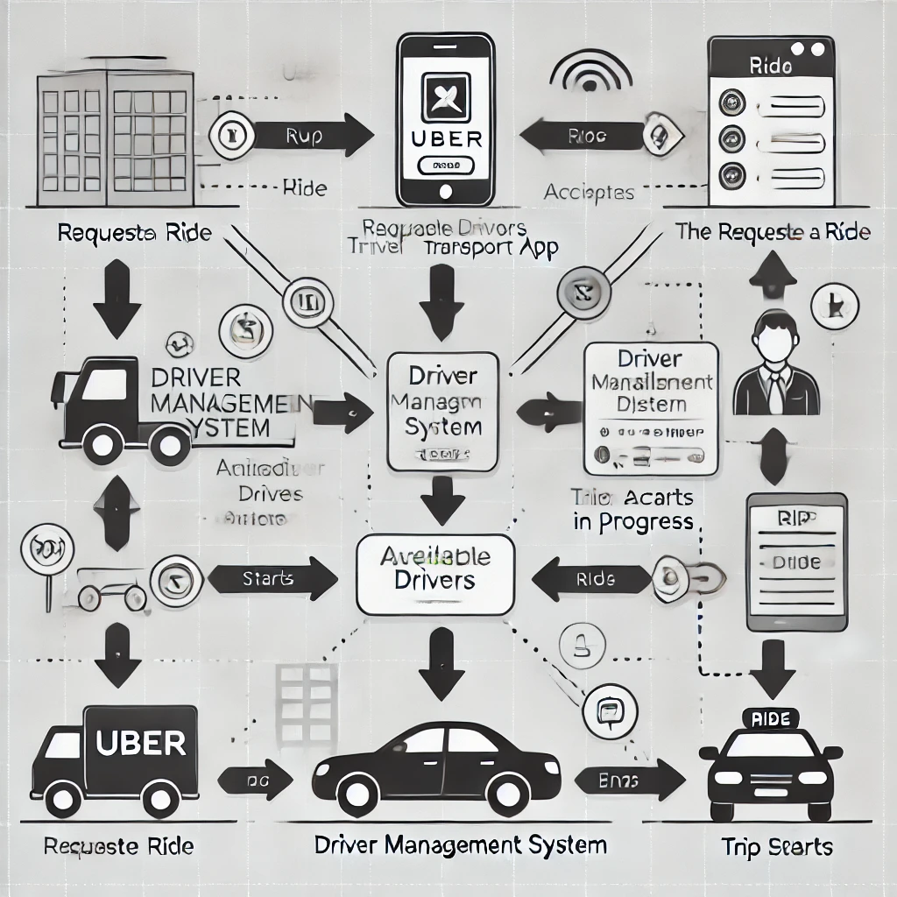
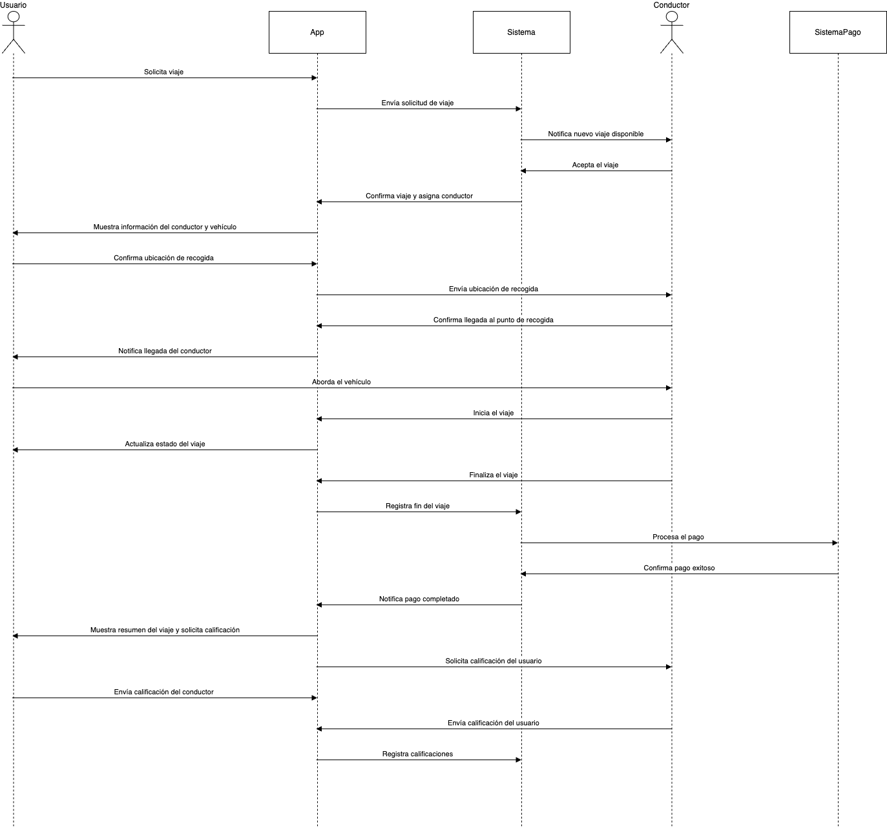
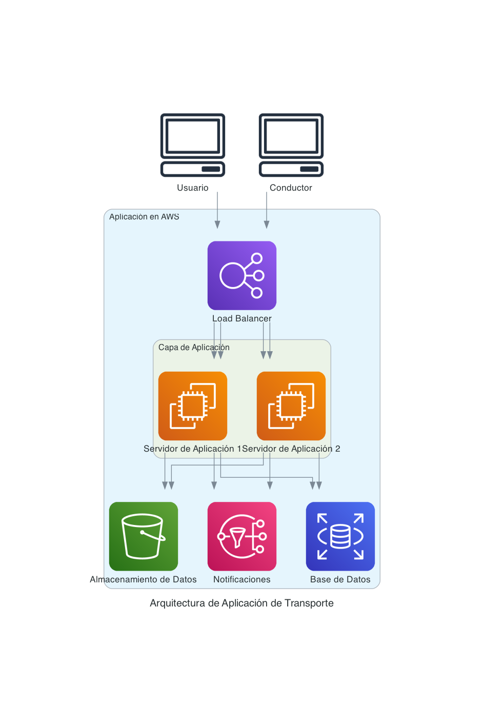
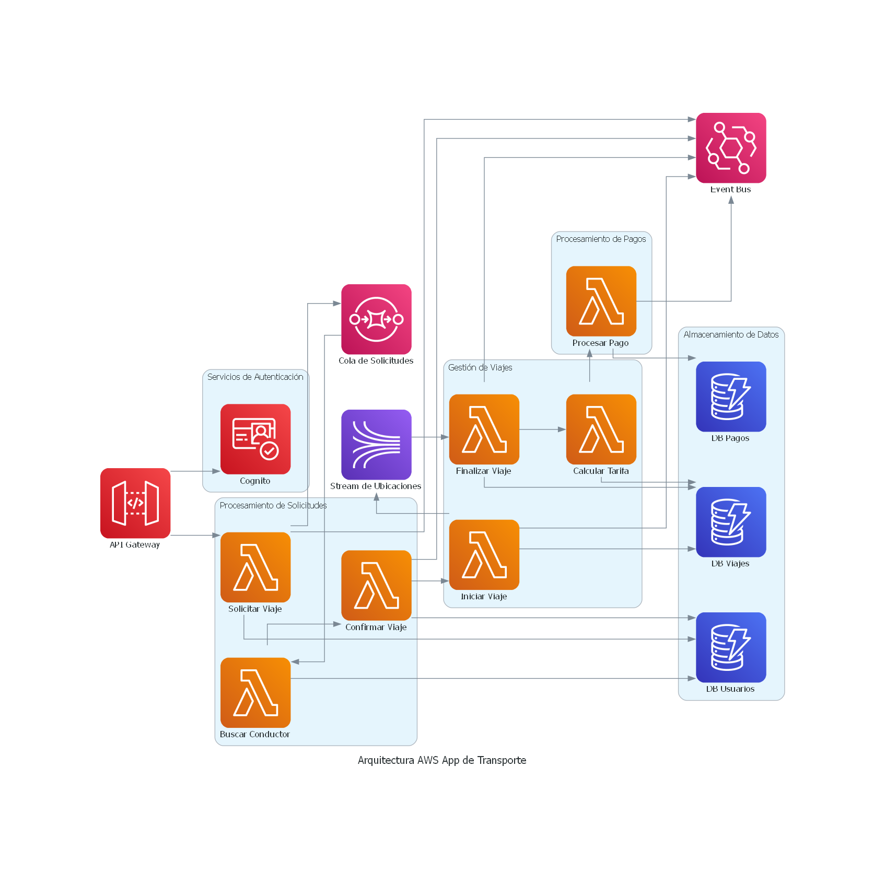

# Fase 1: Construyendo diagramas con GenAI

## Prompt N1 - Dame un ejemplo de un diagrama de secuencia en PlantUML de una app de transporte similar a Uber

### GPT

```
actor Usuario as U
participant "App de Transporte" as App
participant "Sistema de Gestión de Conductores" as SGC
participant "Conductor" as C

U -> App: Solicitar viaje
App -> SGC: Buscar conductor disponible
SGC -> C: Notificar solicitud de viaje
C -> SGC: Aceptar solicitud
SGC -> App: Conductor asignado
App -> U: Conductor asignado (datos del conductor)
U -> C: Confirmar ubicación
C -> U: Conductor en camino
C -> App: Conductor ha llegado
App -> U: Notificar llegada del conductor
U -> C: Iniciar viaje
C -> App: Viaje en curso
App -> U: Viaje en curso
C -> App: Finalizar viaje
App -> U: Notificar fin del viaje
U -> App: Realizar pago
App -> C: Confirmar pago
```

### CLAUDE

```
sequenceDiagram
    actor Usuario
    participant App
    participant Sistema
    actor Conductor
    participant SistemaPago

    Usuario->>App: Solicita viaje
    App->>Sistema: Envía solicitud de viaje
    Sistema->>Conductor: Notifica nuevo viaje disponible
    Conductor->>Sistema: Acepta el viaje
    Sistema->>App: Confirma viaje y asigna conductor
    App->>Usuario: Muestra información del conductor y vehículo

    Usuario->>App: Confirma ubicación de recogida
    App->>Conductor: Envía ubicación de recogida
    Conductor->>App: Confirma llegada al punto de recogida
    App->>Usuario: Notifica llegada del conductor

    Usuario->>Conductor: Aborda el vehículo
    Conductor->>App: Inicia el viaje
    App->>Usuario: Actualiza estado del viaje

    Conductor->>App: Finaliza el viaje
    App->>Sistema: Registra fin del viaje
    Sistema->>SistemaPago: Procesa el pago
    SistemaPago->>Sistema: Confirma pago exitoso
    Sistema->>App: Notifica pago completado
    App->>Usuario: Muestra resumen del viaje y solicita calificación
    App->>Conductor: Solicita calificación del usuario

    Usuario->>App: Envía calificación del conductor
    Conductor->>App: Envía calificación del usuario
    App->>Sistema: Registra calificaciones

```

## Prompt N2 - Me puedes mostrar la gráfica de ese lenguaje?

### GPT



### CLAUDE



## Prompt N3 - Ahora ayúdame a crear el diagrams de arquitectura utilizando la librería Diagram y Python para pintarla suponiendo que uso AWS

### GPT



### CLAUDE



# Notas Generales

Este apartado contiene la carpeta iniciativa, que corresponde al último punto de la fase 1 del workshop 5.

"Describe, inspirándote en estos prompts (compara los dos LLMs), la prueba que estás realizando para tu proyecto (el demo que tienes pensado para el MVP). 

Intenta describir todos los componentes clave a nivel arquitectónico y haz iteraciones hasta llegar a la versión que realmente refleje la prueba que deseas realizar. Genera el diagrama de secuencia, un diagrama de interacción de entidades y la arquitectura tentativa para AWS."
