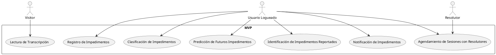
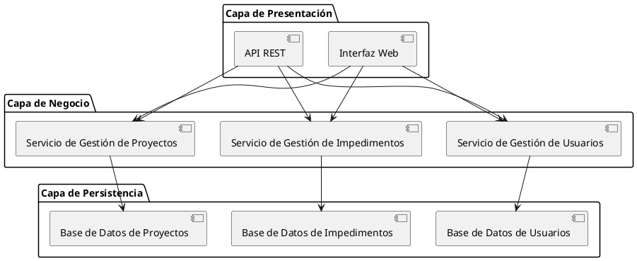
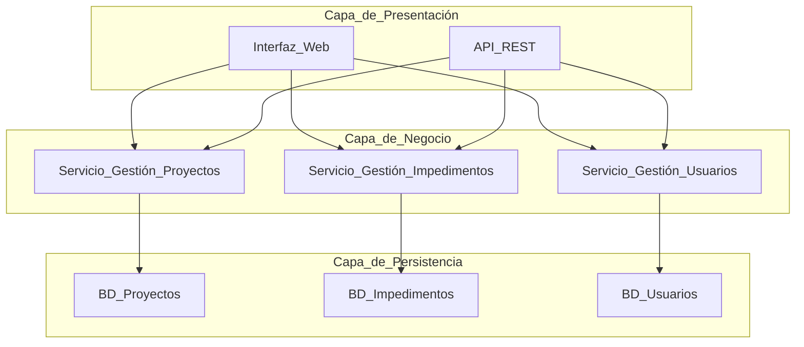
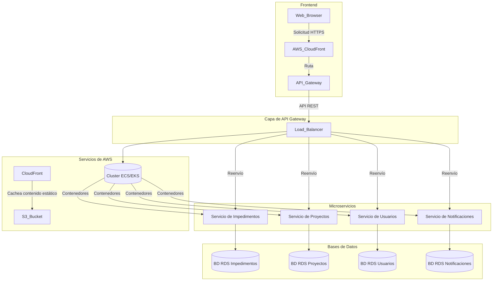

# Fase 2: Planeando un software con GenAI

## Investigación del tipo de sistemas que queremos trabajar

## Prompt N1 - Eres un experto en producto, con experiencia en [Sistemas de gestión inteligente de impedimentos en tiempo real para proyectos ágiles].
¿Qué funcionalidades básicas tiene un [Sistemas de gestión inteligente de impedimentos en tiempo real para proyectos ágiles]?
Descríbemelas en un listado, ordenado de mayor a menor prioridad

### GPT

```
Aquí tienes un listado de las funcionalidades básicas de un **Sistema de gestión inteligente de impedimentos en tiempo real para proyectos ágiles**, ordenadas de mayor a menor prioridad:

1. **Detección automática de impedimentos**: Capacidad de identificar bloqueos o impedimentos en tiempo real a partir de datos provenientes de reuniones diarias (dailys), mensajes en herramientas como Slack o actualizaciones en herramientas de gestión de proyectos (Jira, Trello, etc.).

2. **Alertas y notificaciones en tiempo real**: Envío automático de alertas a los miembros del equipo y Scrum Master sobre la existencia de un impedimento, priorizando los más críticos para la entrega del sprint.

3. **Clasificación y priorización de impedimentos**: Uso de algoritmos inteligentes para clasificar los impedimentos según su impacto y urgencia, facilitando la toma de decisiones para la resolución.

4. **Sugerencias y recomendaciones de resolución**: Provisión de sugerencias basadas en datos históricos y mejores prácticas ágiles, ayudando al equipo a resolver impedimentos rápidamente.

5. **Registro histórico y seguimiento de impedimentos**: Base de datos de impedimentos pasados, permitiendo al equipo revisar qué bloqueos se han presentado antes y cómo fueron resueltos.

6. **Asignación automática de responsables**: Designación automática de los responsables más adecuados para resolver el impedimento, según su disponibilidad, habilidades y experiencia previa.

7. **Integración con herramientas de gestión ágil**: Conexión con plataformas como Jira, Trello, Azure DevOps, para sincronizar información y mantener todo el flujo de trabajo integrado.

8. **Dashboard de visibilidad y reportes**: Visualización en tiempo real del estado de los impedimentos en un tablero central, mostrando métricas clave como el tiempo de resolución y el impacto en el sprint.

9. **Análisis predictivo de riesgos**: Anticipación de posibles bloqueos o cuellos de botella futuros, basándose en patrones de trabajo y datos históricos del equipo.

10. **Capacidades de aprendizaje automático**: Mejora continua del sistema mediante machine learning, para reconocer patrones y reducir la ocurrencia de impedimentos con el tiempo.

11. **Interacción conversacional mediante chatbot**: Asistente virtual integrado que puede responder preguntas sobre impedimentos, recomendar acciones y actualizar el estado del proyecto en herramientas colaborativas. 

12. **Informes periódicos y retrospectivas**: Generación automática de informes para reuniones retrospectivas, destacando patrones de impedimentos y áreas de mejora en la gestión de riesgos.

Este tipo de sistema optimiza la gestión ágil, acelerando la resolución de bloqueos y mejorando la eficiencia del equipo.
```

### CLAUDE

```
Como experto en producto con experiencia en Sistemas de gestión inteligente de impedimentos en tiempo real para proyectos ágiles, puedo describir las funcionalidades básicas de este tipo de sistema, ordenadas de mayor a menor prioridad:

1. Identificación automática de impedimentos:
Analiza en tiempo real las transcripciones de las reuniones diarias
Detecta menciones directas e indirectas de problemas o bloqueos
Utiliza procesamiento de lenguaje natural para comprender el contexto

2. Clasificación y priorización de impedimentos:
Categoriza los impedimentos por tipo (técnico, de recursos, de proceso, etc.)
Asigna niveles de prioridad basados en el impacto potencial en el proyecto
Considera la urgencia y la complejidad del impedimento

3. Sugerencia de soluciones automáticas:
Propone soluciones para problemas técnicos comunes
Utiliza una base de conocimiento actualizada con experiencias previas
Ofrece enlaces a recursos o documentación relevante

4. Escalamiento inteligente:
Identifica al especialista o equipo más adecuado para resolver el impedimento
Notifica automáticamente a los responsables a través de canales predefinidos (ej. Slack)
Proporciona contexto completo del problema al escalar

5. Seguimiento y monitoreo de impedimentos:
Mantiene un registro actualizado del estado de cada impedimento
Envía recordatorios automáticos para impedimentos no resueltos
Genera alertas cuando los impedimentos superan un tiempo de resolución predefinido

6. Integración con herramientas de gestión de proyectos:
Sincroniza información con sistemas como Jira, Trello, o Azure DevOps
Actualiza automáticamente el estado de las tareas afectadas por impedimentos
Permite la visualización de impedimentos en tableros Kanban o backlog del proyecto

7. Análisis predictivo de impedimentos:
Identifica patrones que puedan llevar a futuros impedimentos
Alerta sobre posibles riesgos antes de que se conviertan en problemas reales
Utiliza machine learning para mejorar la precisión de las predicciones con el tiempo

8. Generación automática de informes:
Crea resúmenes diarios/semanales de impedimentos y su estado
Proporciona métricas sobre tiempo de resolución y eficacia de las soluciones
Ofrece visualizaciones para facilitar la comprensión del impacto de los impedimentos

9. Facilitación de colaboración en tiempo real:
Permite discusiones en línea sobre impedimentos específicos
Organiza automáticamente sesiones de resolución de problemas cuando es necesario
Facilita la compartición de conocimientos entre miembros del equipo

10. Personalización y aprendizaje continuo:
Se adapta a las necesidades específicas de cada equipo o proyecto
Aprende de las interacciones y resoluciones pasadas para mejorar sus sugerencias
Permite la retroalimentación del equipo para afinar sus algoritmos y procesos

Estas funcionalidades forman la base de un sistema de gestión inteligente de impedimentos en tiempo real, priorizando la identificación rápida, la resolución eficiente y la mejora continua del proceso de gestión de proyectos ágiles.
```

## Prompt N2 - ¿Qué beneficios obtiene el cliente de un [Sistemas de gestión inteligente de impedimentos en tiempo real para proyectos ágiles] para considerar su uso?

### GPT

```
Los beneficios que obtiene el cliente al utilizar un **Sistema de gestión inteligente de impedimentos en tiempo real para proyectos ágiles** son significativos para mejorar la eficiencia y entrega de valor en sus proyectos. A continuación, los principales beneficios:

1. **Reducción de retrasos en los proyectos**: Al detectar y resolver impedimentos en tiempo real, el sistema minimiza las interrupciones que pueden causar retrasos en los sprints, asegurando una entrega más rápida y dentro de los plazos establecidos.

2. **Mejora en la eficiencia del equipo**: El sistema automatiza la identificación y gestión de impedimentos, permitiendo que el equipo se enfoque en tareas productivas en lugar de dedicar tiempo a la búsqueda y resolución manual de bloqueos.

3. **Mayor visibilidad del estado del proyecto**: Los clientes pueden tener una visión clara y en tiempo real de los impedimentos y su impacto en el proyecto, lo que facilita una mejor toma de decisiones y priorización.

4. **Resolución más rápida de problemas**: Con la clasificación y priorización inteligente de impedimentos, así como las recomendaciones basadas en datos, los bloqueos se resuelven más rápido, reduciendo el tiempo de inactividad del equipo.

5. **Optimización del uso de recursos**: El sistema asigna automáticamente los impedimentos a los miembros del equipo más adecuados, lo que permite un uso más eficiente de los recursos disponibles y maximiza la productividad del equipo.

6. **Mejora continua basada en datos**: Con el registro histórico y el análisis de patrones de impedimentos, el cliente puede aprender de problemas pasados y mejorar continuamente los procesos, reduciendo la repetición de los mismos bloqueos.

7. **Mayor predictibilidad y gestión de riesgos**: Al utilizar análisis predictivo, el cliente puede anticipar posibles bloqueos futuros y tomar medidas proactivas, mejorando la planificación y reduciendo riesgos.

8. **Reducción de costes**: Al resolver problemas más rápidamente y evitar retrasos, el cliente puede optimizar costos, evitando gastos innecesarios relacionados con la ineficiencia y el retrabajo.

9. **Mejora en la colaboración y comunicación**: Al integrar el sistema con herramientas de gestión ágil y plataformas de comunicación como Slack, se mejora la fluidez del trabajo en equipo y se evita que los impedimentos queden sin seguimiento.

10. **Mayor satisfacción del cliente final**: La entrega más ágil y eficiente de los proyectos impacta positivamente en la satisfacción del cliente final, ya que se cumplen los tiempos de entrega y se proporciona un producto de mayor calidad.

Estos beneficios hacen que un sistema de este tipo sea una herramienta valiosa para cualquier organización que trabaje en entornos ágiles, mejorando tanto la productividad interna como los resultados finales del proyecto.
```

## Prompt N3 - ¿Cómo es el customer journey normal de un cliente que usa un [Sistemas de gestión inteligente de impedimentos en tiempo real para proyectos ágiles]? Descríbeme paso a paso todas las interacciones

### GPT

```
El **Customer Journey** de un cliente que utiliza un **Sistema de gestión inteligente de impedimentos en tiempo real para proyectos ágiles** se desarrolla en varias etapas, desde la adquisición hasta el uso diario y la mejora continua. Aquí te presento las fases y las interacciones clave:

### 1. **Investigación y Evaluación**
- **Identificación de la necesidad**: El cliente experimenta bloqueos frecuentes en sus proyectos ágiles, causando retrasos y reduciendo la eficiencia del equipo. Esto lo lleva a investigar herramientas para gestionar impedimentos de manera más eficiente.
- **Investigación de soluciones**: El cliente explora soluciones de software que se ajusten a su entorno ágil y considera la posibilidad de implementar un sistema que automatice la gestión de impedimentos.
- **Demostración y comparación**: El cliente solicita demostraciones de varios sistemas, donde evalúa las funcionalidades clave (detección automática de impedimentos, alertas en tiempo real, recomendaciones de resolución, etc.). Interactúa con el equipo de ventas y soporte de la herramienta.

### 2. **Adquisición y Configuración**
- **Compra o suscripción**: Tras la evaluación, el cliente elige el sistema que mejor se adapta a sus necesidades y adquiere una licencia o suscripción.
- **Onboarding y configuración inicial**: El cliente recibe soporte para configurar el sistema dentro de su entorno ágil, integrando herramientas como Jira, Slack o Trello, y ajustando el sistema a las necesidades específicas de su equipo.
- **Capacitación del equipo**: El equipo del cliente recibe capacitación sobre cómo utilizar el sistema, desde cómo interactuar con las notificaciones en tiempo real hasta cómo revisar y clasificar impedimentos.

### 3. **Implementación y Uso Diario**
- **Identificación de impedimentos**: Una vez en uso, el sistema comienza a detectar automáticamente impedimentos en reuniones diarias, herramientas de mensajería y plataformas de gestión de proyectos.
- **Notificaciones y alertas en tiempo real**: El cliente y su equipo reciben notificaciones de nuevos impedimentos a través de los canales integrados (email, Slack, etc.), asegurando que los bloqueos sean abordados rápidamente.
- **Resolución guiada**: El sistema ofrece recomendaciones basadas en datos históricos y mejores prácticas, lo que guía al equipo para resolver los impedimentos de manera eficiente. Esto reduce la dependencia del factor humano y optimiza la toma de decisiones.
- **Asignación de responsables**: El sistema asigna automáticamente a los miembros del equipo responsables de resolver cada impedimento, según su disponibilidad y habilidades, lo que simplifica la coordinación.

### 4. **Monitoreo y Seguimiento**
- **Visualización de impedimentos en el dashboard**: El cliente accede al tablero central, donde puede monitorear el estado de todos los impedimentos actuales y pasados. El equipo revisa indicadores clave como el tiempo de resolución, el impacto en los sprints y la criticidad de los bloqueos.
- **Reportes de rendimiento**: El sistema genera informes automáticos sobre la gestión de impedimentos, que el cliente puede usar en retrospectivas y reuniones de planificación para ajustar estrategias y optimizar procesos.

### 5. **Análisis y Mejora Continua**
- **Análisis predictivo**: Con el uso continuado, el sistema recopila datos y utiliza análisis predictivo para anticipar futuros bloqueos. Esto permite al cliente ser más proactivo y tomar medidas preventivas antes de que los impedimentos afecten el desarrollo del proyecto.
- **Lecciones aprendidas**: El cliente utiliza el registro histórico de impedimentos para identificar patrones recurrentes y mejorar continuamente la eficiencia de su equipo, evitando bloqueos similares en futuros proyectos.

### 6. **Soporte y Optimización**
- **Soporte técnico**: El cliente puede interactuar con el equipo de soporte para resolver problemas técnicos o ajustar las configuraciones a medida que cambian las necesidades del equipo.
- **Actualizaciones y nuevas funcionalidades**: A medida que el sistema evoluciona, el cliente recibe actualizaciones de software con nuevas funcionalidades que mejoran aún más la gestión de impedimentos.

### 7. **Renovación y Expansión**
- **Renovación de suscripción**: Al final del ciclo de suscripción, el cliente decide renovar el uso del sistema debido a los beneficios obtenidos (reducción de retrasos, mayor eficiencia, etc.).
- **Expansión del uso**: Si el cliente tiene otros equipos o proyectos ágiles, puede decidir expandir el uso del sistema a otras áreas dentro de la organización.

Este recorrido refleja cómo el sistema no solo resuelve problemas inmediatos de gestión de impedimentos, sino que también impulsa mejoras continuas a largo plazo en los proyectos ágiles del cliente.
```
## Planeación del sistema desde los casos de uso

## Prompt N1 - Eres un analista de software experto. Estoy construyendo un MVP de un [Sistema de gestión inteligente de impedimentos en tiempo real para proyectos ágiles] que sólamente haga [Leer la transcripción, identificar los impedimentos reportados y futuros impedimentos, agendar sesiones con las personas que puedan ayudar a resolver los impedimentos]. Enumera y describe brevemente los casos de uso más importantes a implementar para lograr una funcionalidad básica

### GPT
```
Para construir el MVP de un **Sistema de gestión inteligente de impedimentos en tiempo real para proyectos ágiles** con las funcionalidades específicas mencionadas, los **casos de uso más importantes** serían los siguientes:

### 1. **Lectura de Transcripción**
   - **Descripción**: El sistema debe procesar la transcripción de reuniones (como las dailys o retrospectivas) de herramientas como Zoom, Microsoft Teams o Slack, extrayendo el contenido textual.
   - **Objetivo**: Capturar de manera precisa y rápida el contenido hablado para poder identificar posibles impedimentos.

### 2. **Identificación de Impedimentos Reportados**
   - **Descripción**: El sistema debe analizar la transcripción y utilizar un conjunto de palabras clave y reglas de procesamiento de lenguaje natural (NLP) para detectar cuándo un miembro del equipo menciona un impedimento existente.
   - **Objetivo**: Detectar bloqueos explícitamente reportados en la reunión o durante la conversación.

### 3. **Predicción de Futuros Impedimentos**
   - **Descripción**: Utilizar análisis semántico avanzado para identificar señales o patrones que sugieran futuros impedimentos, como frases que indiquen dudas, riesgos o tareas atrasadas.
   - **Objetivo**: Predecir potenciales problemas que podrían convertirse en bloqueos si no se resuelven de inmediato.

### 4. **Clasificación de Impedimentos**
   - **Descripción**: Una vez identificados, el sistema debe clasificar los impedimentos según su urgencia o impacto en el proyecto, asignando un nivel de prioridad.
   - **Objetivo**: Ayudar a los equipos a gestionar mejor el tiempo y priorizar la resolución de los impedimentos más críticos.

### 5. **Agendamiento de Sesiones con Resolutores**
   - **Descripción**: El sistema debe identificar las personas adecuadas que puedan ayudar a resolver cada impedimento (basándose en roles y experiencia) y automáticamente agendar sesiones de resolución de problemas.
   - **Objetivo**: Automatizar la coordinación de reuniones entre los responsables de resolver los impedimentos y los afectados.

### 6. **Notificación de Impedimentos**
   - **Descripción**: Después de identificar y clasificar un impedimento, el sistema debe notificar a los responsables y partes interesadas, utilizando herramientas de comunicación como Slack o email.
   - **Objetivo**: Asegurar que todos estén al tanto de los impedimentos y puedan actuar rápidamente.

### 7. **Registro de Impedimentos**
   - **Descripción**: Guardar los impedimentos identificados en un registro para su seguimiento, permitiendo una revisión en cualquier momento, y brindando un historial de los problemas enfrentados durante el proyecto.
   - **Objetivo**: Facilitar el seguimiento de impedimentos y asegurar que no queden sin resolver.

Implementar estos casos de uso garantizará una funcionalidad básica eficiente para la versión MVP del sistema.
```

## Prompt N2

### GPT
```
Parece que el entorno no cuenta con el módulo necesario para generar diagramas PlantUML. Sin embargo, te proporcionaré el código PlantUML que puedes utilizar en cualquier herramienta compatible con PlantUML, como Visual Studio Code (con la extensión PlantUML) o el sitio web [PlantUML](http://www.plantuml.com/plantuml/uml).



# Let's render the PlantUML diagram.
from pathlib import Path
import matplotlib.pyplot as plt
from plantuml import PlantUML

# Define the output file path
output_path = Path("/mnt/data/diagram_mvp_usecases.png")

# Use PlantUML server to render the image
plantuml_server = PlantUML(url="http://www.plantuml.com/plantuml/img/")
response = plantuml_server.processes(plantuml_code)

# Save the image to the output path
output_path.write_bytes(response)

# Now display the image
img = plt.imread(output_path)
plt.figure(figsize=(8, 8))
plt.imshow(img)
plt.axis('off')
plt.show()


### Descripción:
- **Visitor**: Un usuario no autenticado que solo puede acceder a la funcionalidad de lectura de transcripción.
- **Usuario Logueado**: Un usuario autenticado que puede identificar impedimentos, predecir futuros bloqueos, clasificarlos, agendar sesiones y recibir notificaciones.
- **Resolutor**: Persona encargada de resolver impedimentos, quien interactúa en el caso de uso de agendamiento de sesiones.

Este diagrama captura los principales casos de uso y las interacciones entre usuarios.
```


## Diseñemos ahora las entidades principales para la base de datos:

## Prompt N1 - Eres un arquitecto de software experto. Cuales son las 3 entidades de modelo de datos esenciales en un sistema de [Sistemas de gestión Inteligente de impedimentos en tiempo real para proyectos ágiles]? Dame algunos campos esenciales de cada una y cómo se relacionan

### GPT
```
En un **Sistema de gestión inteligente de impedimentos en tiempo real para proyectos ágiles**, las tres entidades esenciales del modelo de datos son:

### 1. **Impedimento**
   - **Descripción**: Representa cualquier bloqueo o impedimento identificado que puede afectar el progreso del proyecto.
   - **Campos esenciales**:
     - `id`: Identificador único del impedimento.
     - `descripcion`: Texto detallado que describe el impedimento.
     - `estado`: Estado del impedimento (e.g., "Pendiente", "Resuelto", "En Progreso").
     - `prioridad`: Nivel de importancia del impedimento (e.g., "Alta", "Media", "Baja").
     - `fecha_creacion`: Fecha en que se detectó el impedimento.
     - `fecha_resolucion`: Fecha en que el impedimento fue resuelto (puede ser nulo si no ha sido resuelto).
     - `tipo`: Categoría del impedimento (e.g., "Técnico", "Procesos", "Recursos").
     - `proyecto_id`: Referencia al proyecto al que pertenece el impedimento.
   
   - **Relaciones**:
     - Un **impedimento** puede estar relacionado con un **proyecto** y un **resolutor** (usuario asignado para resolverlo).

### 2. **Proyecto**
   - **Descripción**: Representa los proyectos ágiles dentro de los cuales se detectan los impedimentos.
   - **Campos esenciales**:
     - `id`: Identificador único del proyecto.
     - `nombre`: Nombre del proyecto.
     - `descripcion`: Descripción del proyecto.
     - `fecha_inicio`: Fecha de inicio del proyecto.
     - `fecha_fin_estimada`: Fecha estimada de finalización del proyecto.
     - `equipo_id`: Referencia al equipo que trabaja en el proyecto.
   
   - **Relaciones**:
     - Un **proyecto** tiene múltiples **impedimentos**. Un **proyecto** está asociado a un **equipo** de trabajo.

### 3. **Usuario (Resolutor)**
   - **Descripción**: Representa a los miembros del equipo, especialmente aquellos que pueden ser asignados para resolver impedimentos.
   - **Campos esenciales**:
     - `id`: Identificador único del usuario.
     - `nombre`: Nombre del usuario.
     - `rol`: Rol dentro del proyecto (e.g., "Scrum Master", "Desarrollador", "Tester").
     - `email`: Dirección de correo electrónico para notificaciones.
     - `disponibilidad`: Disponibilidad del usuario para resolver impedimentos (e.g., "Disponible", "Ocupado").
   
   - **Relaciones**:
     - Un **usuario** puede estar asociado a múltiples **impedimentos** como resolutor. También pertenece a un **equipo**.

### Relaciones entre las entidades:
- **Impedimento** ↔ **Proyecto**: Un proyecto puede tener múltiples impedimentos, y cada impedimento está asociado a un único proyecto (`proyecto_id` en la entidad **Impedimento**).
- **Impedimento** ↔ **Usuario (Resolutor)**: Un impedimento puede ser asignado a un resolutor específico, que es el responsable de resolver el bloqueo (`resolutor_id` o `usuario_id` en la entidad **Impedimento**).
- **Proyecto** ↔ **Usuario**: Un proyecto está gestionado por un equipo de usuarios, donde cada usuario puede desempeñar distintos roles dentro del proyecto.

Estas entidades forman la base del sistema, permitiendo gestionar eficientemente los impedimentos, el avance de los proyectos y la asignación de responsabilidades.
```


## Prompt N2 - Eres un arquitecto de software. Eres capaz de diseñar, explicar y diagramar los diferentes aspectos de un sistema de software. 
Estoy construyendo un sistema de [Sistemas de gestión Inteligente de impedimentos en tiempo real para proyectos ágiles]. He definido las entidades [Impedimento, proyecto y usuario resolutor], con sus campos y relaciones.

### GPT
```
¡Excelente! Ya que has definido las entidades clave (**Impedimento**, **Proyecto** y **Usuario Resolutor**) junto con sus campos y relaciones, podemos proceder con el diseño del sistema. Te explicaré cómo podemos estructurar y organizar los aspectos principales del sistema en términos de arquitectura, y cómo cada entidad interactúa dentro de una arquitectura típica de software.

### Aspectos clave para el diseño del sistema

1. **Arquitectura en capas**:
   - **Capa de presentación (UI/UX)**: Es donde los usuarios interactúan con el sistema. Aquí se puede incluir un panel de control para visualizar los impedimentos, gestionar los proyectos y asignar/resolver impedimentos. Las tecnologías para esta capa podrían incluir frameworks frontend como React o Angular.
   - **Capa de negocio (Servicios)**: Esta capa gestiona la lógica del negocio, como la identificación de impedimentos, asignación automática de resolutores, generación de reportes, etc. Puede estar construida usando microservicios o una arquitectura monolítica ligera con tecnologías como Node.js, Python (Django/Flask), o Java (Spring Boot).
   - **Capa de datos (Persistencia)**: Es la capa encargada de almacenar los datos relacionados con proyectos, impedimentos y usuarios resolutores. Aquí utilizaríamos un sistema de base de datos relacional como PostgreSQL o MySQL para gestionar las relaciones entre estas entidades.

2. **Flujo básico del sistema**:
   - Un usuario resolutor inicia sesión y accede al sistema.
   - El sistema analiza las transcripciones de reuniones o interacciones (fuente de datos de impedimentos).
   - Los impedimentos detectados se registran automáticamente en la base de datos y se relacionan con el proyecto correspondiente.
   - El sistema asigna automáticamente resolutores basándose en su disponibilidad y rol.
   - Se generan alertas o notificaciones sobre los impedimentos detectados y pendientes.
   - Los usuarios pueden marcar impedimentos como resueltos o cambiar su estado.

### Relación de entidades y flujos:

- **Proyecto**: Los proyectos contienen impedimentos y están asociados con un equipo.
- **Impedimento**: Está vinculado a un proyecto y a un resolutor, y contiene información como prioridad, estado, descripción, y fechas.
- **Usuario Resolutor**: Es un miembro del equipo que puede ser asignado para resolver los impedimentos. Puede ser notificado sobre nuevos bloqueos y tiene acceso a los proyectos en los que trabaja.

### Diagrama de componentes del sistema

Para representar el sistema a nivel alto, te sugiero un **diagrama de componentes**, que nos ayude a visualizar las interacciones entre las capas del sistema y los módulos principales. Te proporcionaré el código en PlantUML para que puedas generar el diagrama.

### Diagrama de componentes en PlantUML



### Explicación del Diagrama:

- **Capa de Presentación**: Consiste en una interfaz web y una API REST que permiten a los usuarios interactuar con el sistema. La interfaz web es utilizada por los usuarios para visualizar y gestionar los proyectos e impedimentos. La API REST permite integrar el sistema con otras herramientas de gestión de proyectos.
  
- **Capa de Negocio**: Aquí se encuentran los servicios que encapsulan la lógica del negocio. Los servicios gestionan las reglas de detección de impedimentos, la asignación de resolutores y la administración de proyectos.
  - **Servicio de Gestión de Impedimentos**: Responsable de la detección y seguimiento de los impedimentos.
  - **Servicio de Gestión de Proyectos**: Gestiona la creación, actualización y eliminación de proyectos.
  - **Servicio de Gestión de Usuarios**: Administra los resolutores y su disponibilidad.

- **Capa de Persistencia**: Esta capa almacena la información estructurada en bases de datos relacionales. Cada base de datos se encarga de mantener la información de **proyectos**, **impedimentos** y **usuarios resolutores**.

### Siguiente paso: **Interacciones entre componentes**

Al haber definido las relaciones, podemos empezar a trabajar en los flujos de interacción y lógica específica para la detección y gestión de impedimentos, como algoritmos de asignación de resolutores o estrategias de notificación. Si tienes alguna otra área específica que te gustaría desarrollar más a fondo, podemos profundizar en ello.
```

## Prompt N3 - Generame un diagrama Mermaid de este sistema

### GPT
```
Aquí tienes el diagrama en formato **Mermaid** para representar la arquitectura del sistema de gestión inteligente de impedimentos en tiempo real:



### Descripción del Diagrama:
1. **Capa de Presentación**: Consiste en la `Interfaz Web` y la `API REST` que permiten a los usuarios interactuar con el sistema.
2. **Capa de Negocio**: Los servicios (`Servicio de Gestión de Impedimentos`, `Servicio de Gestión de Proyectos`, `Servicio de Gestión de Usuarios`) manejan la lógica del sistema, gestionando las interacciones entre los usuarios, los proyectos y los impedimentos.
3. **Capa de Persistencia**: Base de datos relacionales que almacenan los datos de `Proyectos`, `Impedimentos` y `Usuarios`.

Este diagrama organiza claramente las diferentes capas del sistema y sus interacciones principales. Puedes utilizar este código en cualquier herramienta que soporte **Mermaid** para visualizar el diagrama.
```

## Generar el diagrama de arquitectura con DiagramGPT

## Prompt N1 - A microservices architecture for an [Intelligent real-time impediment management systems for agile projects] system like expedia
Each MS has its own database
Also has a frontend that communicates through API
Cloud provider is AWS, use proper services
Include load balancing and CDN

### GPT
```
¡Claro! Aquí tienes la arquitectura en español para un **Sistema de Gestión Inteligente de Impedimentos en Tiempo Real** con una arquitectura de microservicios en AWS, similar a Expedia, donde cada microservicio tiene su propia base de datos, el frontend se comunica a través de una API y se utilizan servicios de AWS como balanceo de carga y CDN:

---
### Diagrama de Arquitectura en Texto (Mermaid)


---
### Componentes Detallados:

1. **Frontend**:
   - **React/Angular/Vue.js**: Utilizado para crear la interfaz de usuario del sistema.
   - **AWS CloudFront**: Red de entrega de contenido (CDN) para distribuir el frontend con baja latencia y alta velocidad en todo el mundo.
   - **S3**: Los archivos estáticos (HTML, CSS, JS, imágenes) se almacenan en un bucket de **Amazon S3**.

2. **Capa de API Gateway**:
   - **AWS API Gateway**: Expone las APIs RESTful para cada microservicio y maneja las solicitudes del frontend. Administra la autenticación, autorización, limitación de tasa y enrutamiento.

3. **Microservicios**:
   - **Amazon ECS/EKS**: Cada microservicio se ejecuta en su propio contenedor usando **AWS ECS (Elastic Container Service)** o **EKS (Elastic Kubernetes Service)**. Esto permite ejecutar, escalar y gestionar aplicaciones contenedorizadas.
   - **Load Balancer**: Un **Elastic Load Balancer (ALB)** distribuye el tráfico entrante de la API entre los microservicios. Soporta enrutamiento basado en rutas para diferentes servicios.
   - **Microservicios**:
     - **Servicio de Impedimentos**: Maneja la detección, seguimiento y resolución de impedimentos.
     - **Servicio de Proyectos**: Gestiona los detalles de los proyectos y su progreso.
     - **Servicio de Usuarios**: Administra los usuarios, sus roles y el control de acceso.
     - **Servicio de Notificaciones**: Envía notificaciones a los usuarios sobre nuevos impedimentos o actualizaciones.

4. **Bases de Datos**:
   - Cada microservicio tiene su propia base de datos para garantizar el desacoplamiento y la separación de datos.
   - **Amazon RDS**: Cada microservicio utiliza una instancia independiente de **Amazon RDS** (PostgreSQL, MySQL).
     - El Servicio de Impedimentos usa `BD_Impedimento`.
     - El Servicio de Proyectos usa `BD_Proyecto`.
     - El Servicio de Usuarios usa `BD_Usuario`.
     - El Servicio de Notificaciones usa `BD_Notificaciones`.

5. **Infraestructura de AWS**:
   - **Amazon CloudFront**: Proporciona una red de entrega de contenido (CDN) para entregar rápidamente los activos del frontend a nivel global.
   - **Amazon S3**: Utilizado para almacenar contenido estático como HTML, CSS, JavaScript y archivos multimedia.
   - **Amazon ECS/EKS**: Gestiona los microservicios en contenedores. **ECS** utiliza AWS Fargate para la gestión sin servidores de los contenedores, mientras que **EKS** utiliza Kubernetes para la orquestación.
   - **Elastic Load Balancer (ALB)**: Distribuye el tráfico entre los microservicios y realiza el balanceo de carga, evitando sobrecargas en una sola instancia.
   - **Amazon Route 53**: Servicio de DNS que enruta el tráfico a **CloudFront** y **API Gateway**.

6. **Monitoreo y Seguridad**:
   - **Amazon CloudWatch**: Monitorea logs, métricas y alarmas para rastrear el rendimiento y la salud del sistema.
   - **AWS IAM**: Gestión de Identidad y Acceso para control de acceso basado en roles.
   - **AWS WAF (Web Application Firewall)**: Protege la aplicación contra ataques web comunes.

### Características Clave:
- **Escalabilidad**: El sistema puede escalar automáticamente la cantidad de contenedores en **ECS** según la demanda.
- **Aislamiento**: Cada microservicio tiene su propia base de datos, lo que asegura la separación de responsabilidades y reduce los riesgos de un único punto de fallo.
- **Disponibilidad Global**: **CloudFront** asegura baja latencia globalmente, mientras que **API Gateway** maneja el failover.
- **Balanceo de Carga**: **ALB** asegura la distribución del tráfico a través de los microservicios, evitando sobrecargas.

Este diseño ofrece una solución robusta y escalable para gestionar impedimentos en tiempo real en proyectos ágiles, aprovechando las mejores prácticas de AWS en una arquitectura de microservicios.
```

